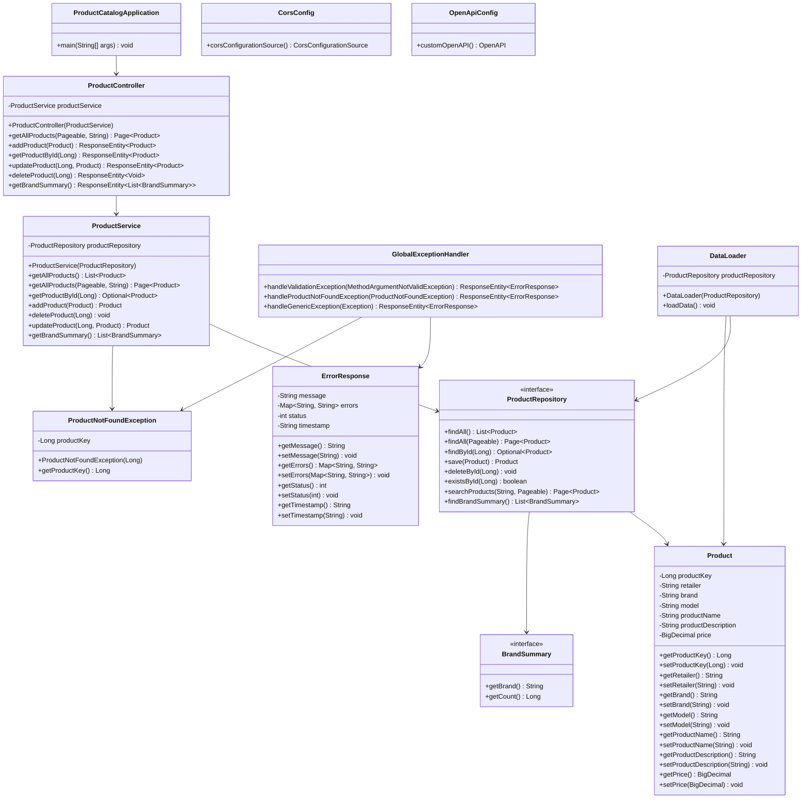
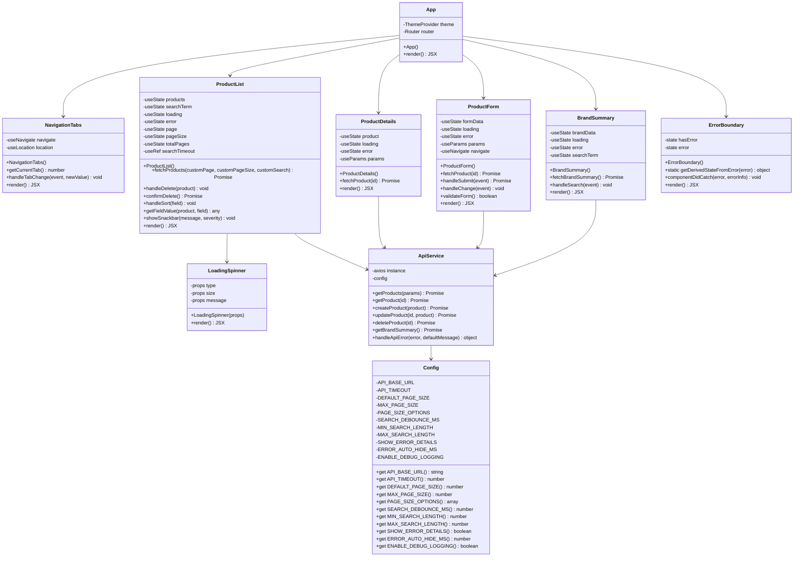
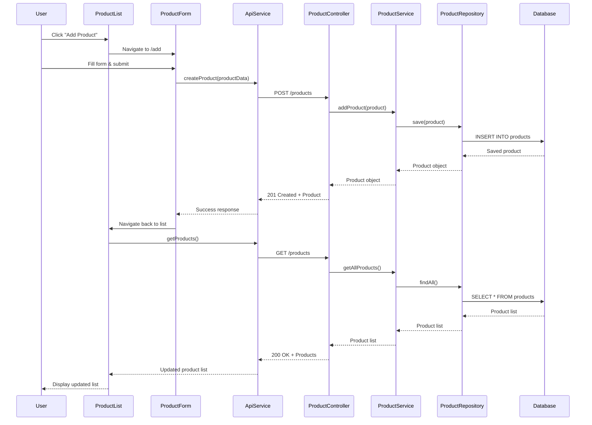
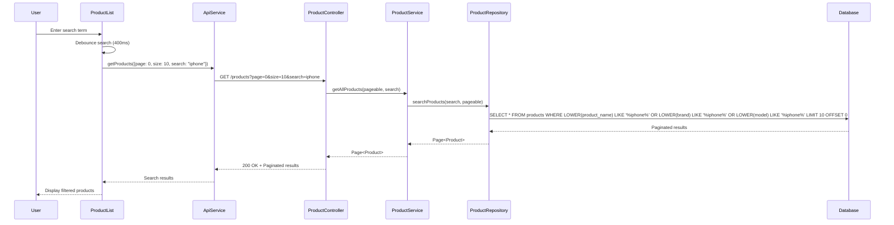
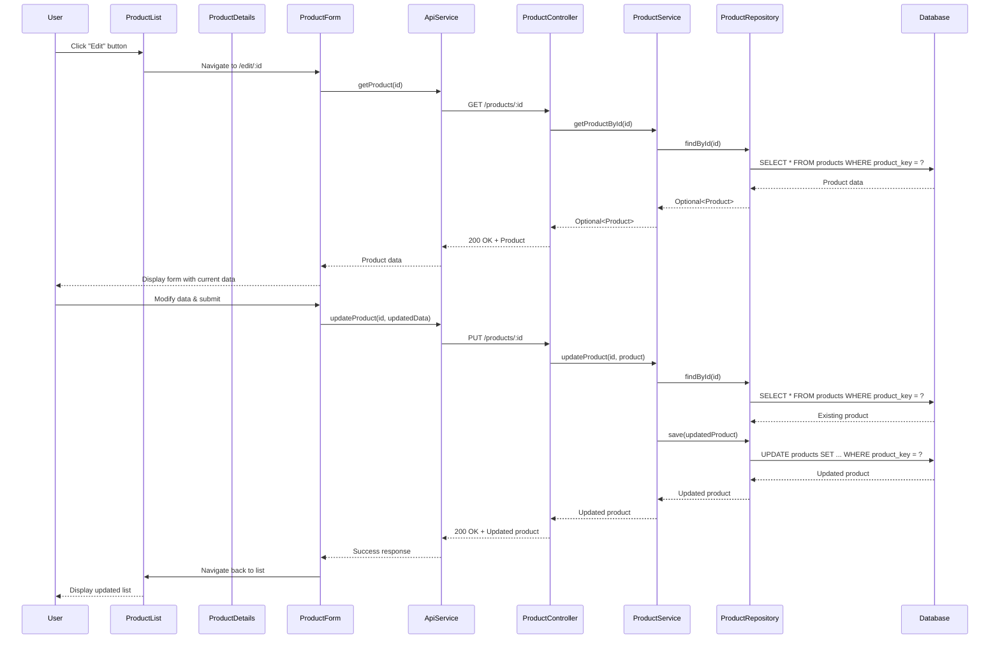
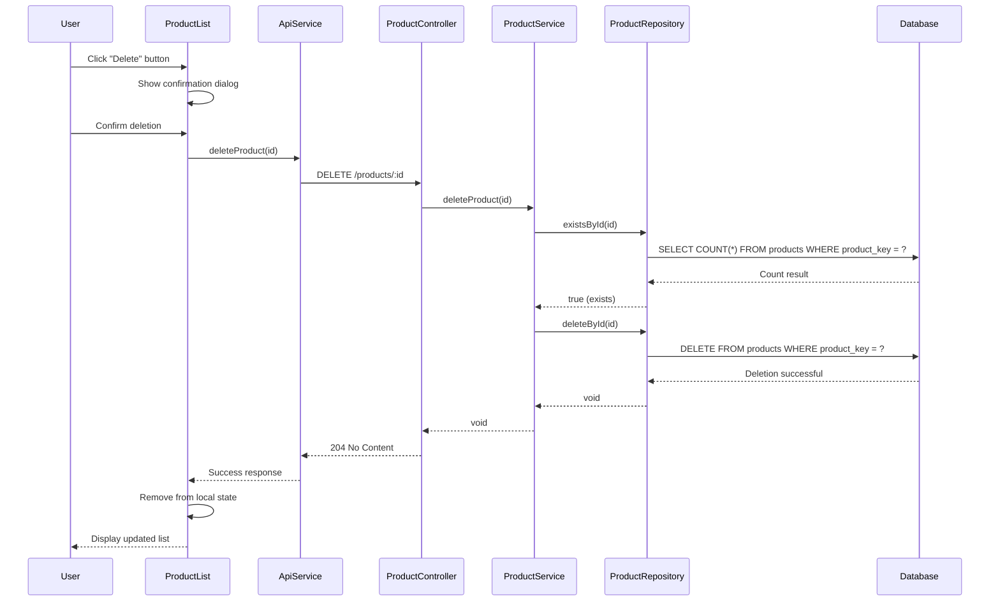
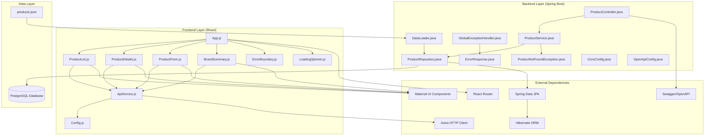
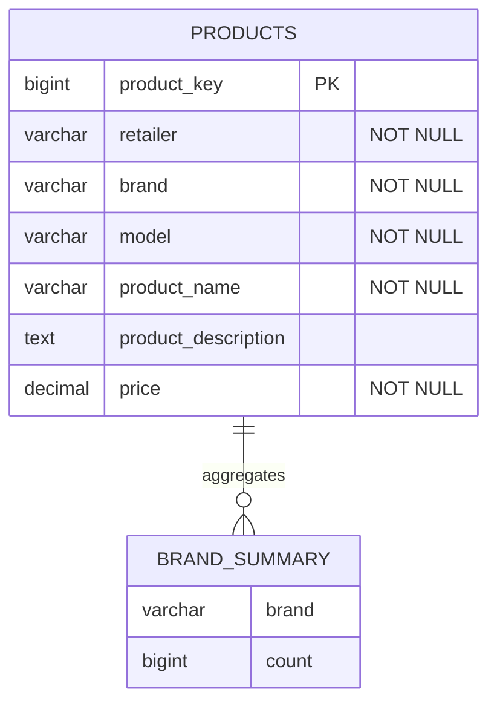
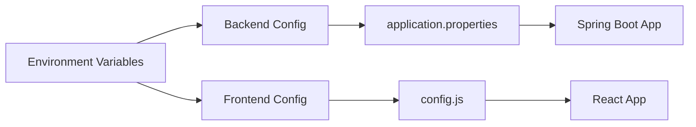

# Product Catalog Manager - UML Diagrams

## 🏗️ System Architecture Overview

```
┌─────────────────────────────────────────────────────────────────────────────┐
│                           Product Catalog Manager                           │
├─────────────────────────────────────────────────────────────────────────────┤
│                                                                             │
│  ┌─────────────────┐    HTTP/REST    ┌─────────────────┐                   │
│  │   React Frontend │ ◄─────────────► │ Spring Boot API │                   │
│  │   (Port 3000)   │                 │   (Port 8080)   │                   │
│  └─────────────────┘                 └─────────────────┘                   │
│           │                                     │                          │
│           │                                     │                          │
│           ▼                                     ▼                          │
│  ┌─────────────────┐                 ┌─────────────────┐                   │
│  │   PostgreSQL    │                 │   PostgreSQL    │                   │
│  │   (Port 5432)   │                 │   (Port 5432)   │                   │
│  └─────────────────┘                 └─────────────────┘                   │
│                                                                             │
└─────────────────────────────────────────────────────────────────────────────┘
```

## 📊 Class Diagram - Backend (Spring Boot)



## 🎨 Class Diagram - Frontend (React)



## 🔄 Sequence Diagram - Product CRUD Operations

### Create Product


### Read Products with Pagination & Search


### Update Product


### Delete Product


## 🏛️ Component Diagram - System Architecture



## 📋 Database Schema Diagram



## 🔐 Security & Validation Flow

```mermaid
flowchart TD
    A[Client Request] --> B{Valid Format?}
    B -->|No| C[400 Bad Request]
    B -->|Yes| D[Controller Layer]
    D --> E{@Valid Annotation?}
    E -->|No| F[Service Layer]
    E -->|Yes| G[Validation Layer]
    G --> H{Validation Pass?}
    H -->|No| I[GlobalExceptionHandler]
    I --> J[ErrorResponse]
    J --> K[400 Bad Request + Details]
    H -->|Yes| F
    F --> L{Business Logic Valid?}
    L -->|No| M[Custom Exception]
    M --> I
    L -->|Yes| N[Repository Layer]
    N --> O[Database]
    O --> P[Success Response]
```

## 📊 API Endpoints Summary

| Method | Endpoint | Description | Request Body | Response |
|--------|----------|-------------|--------------|----------|
| GET | `/products` | List products with pagination | - | `Page<Product>` |
| GET | `/products/{id}` | Get product by ID | - | `Product` |
| POST | `/products` | Create new product | `Product` | `Product` (201) |
| PUT | `/products/{id}` | Update product | `Product` | `Product` |
| DELETE | `/products/{id}` | Delete product | - | `204 No Content` |
| GET | `/products/brand-summary` | Get brand statistics | - | `List<BrandSummary>` |

## 🎯 Key Design Patterns Used

1. **MVC Pattern**: Separation of concerns between Model, View, and Controller
2. **Repository Pattern**: Data access abstraction layer
3. **Service Layer Pattern**: Business logic encapsulation
4. **DTO Pattern**: Data transfer objects for API communication
5. **Exception Handler Pattern**: Centralized error handling
6. **Configuration Pattern**: Environment-based configuration management
7. **Component Pattern**: Reusable React components
8. **Hooks Pattern**: React functional components with state management

## 🔧 Configuration Management



This UML documentation provides a comprehensive view of the Product Catalog Manager's architecture, showing the relationships between components, data flow, and system design patterns. 